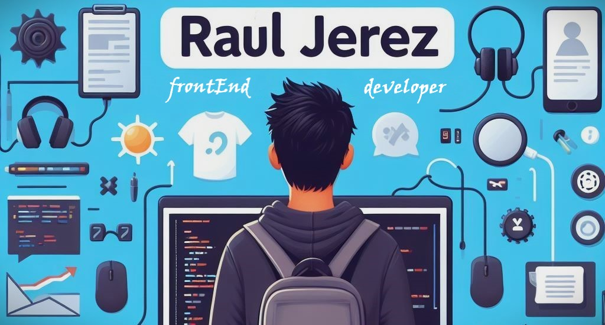

<h1>Hola, soy Raúl </h1>

## Sobre mi 
 

- 💻 Full Stack developer
- 🛠 Proactivo
- 🤝 Trabajo en equipo 
- 🚀 En constante crecimiento
- 🧐 Dato curioso: Me encanta el bricolaje
  
 

<h2 align="left"> Mis habilidades  </h2>
 

    
   
   
  

<h2> Contacto  </h2>
 
 &emsp;&emsp;
&emsp;&emsp;

 

